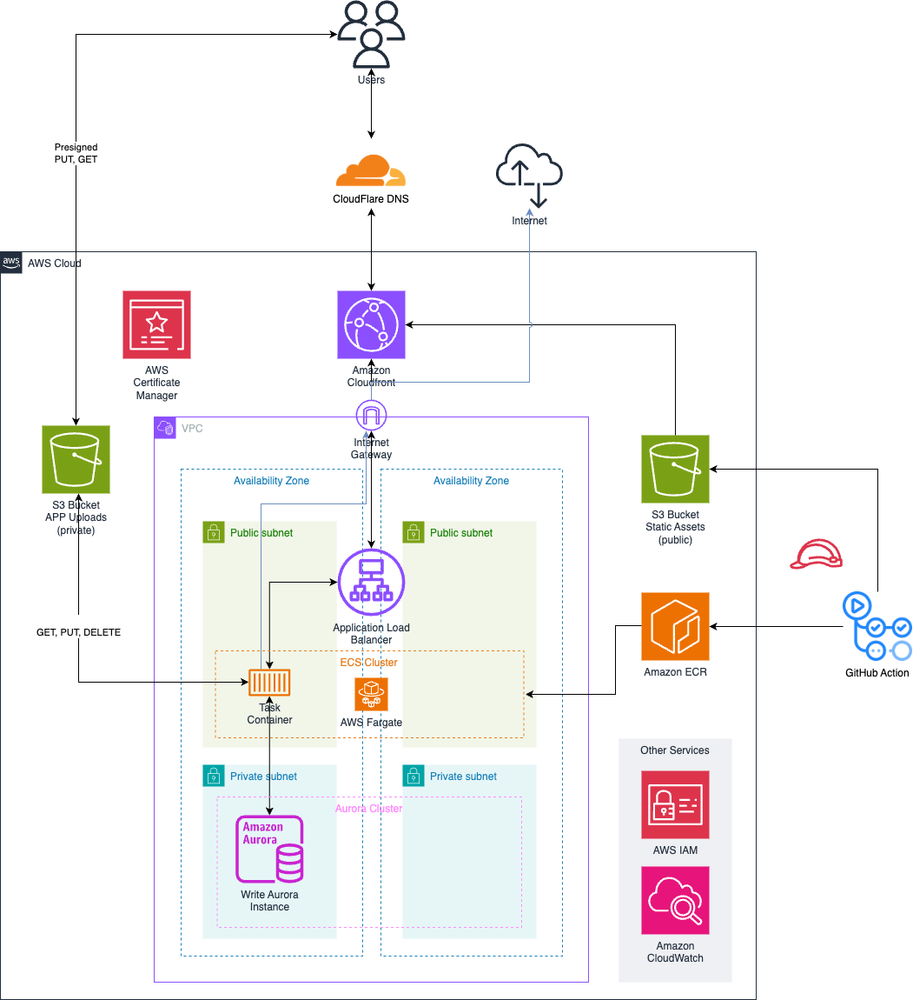

# Next.js GitHub Actions CD + AWS CDK Infrastructure

> If you're looking for a solution with a lower TCO, please refer to the [low-cost](https://github.com/dcastillogi/aws-nextjs-deployment/tree/low-cost) branch.

Are you looking to deploy your Next.js project on AWS with high availability? This repository has everything you need:  

- **AWS CDK**: Automates infrastructure deployment, including:  
  - High-availability configuration for your Next.js deployment.  
  - An **S3 bucket** for file uploads.  
  - A **PostgreSQL** database.  
- **GitHub Actions**: Preconfigured for seamless CI/CD, enabling continuous integration and deployment.  

Simplify your deployment workflow and leverage the power of AWS and GitHub Actions to take your project to production effortlessly.  

## Architecture



## Next.js project

The deployment Docker image relies on the Next.js output configuration set to `standalone`. Make sure to configure it properly.

For more details, refer to the [Next.js documentation on output configuration](https://nextjs.org/docs/pages/api-reference/next-config-js/output).

Additionally, store all static assets in the `public/static/` directory, as this is the directory CloudFront will use to serve images.

## Deployment Guide

Follow the steps below to deploy the application successfully:

### 1. Configure Dockerfile and .dockerignore

Copy the `Dockerfile` and `.dockerignore` files to the root directory of your Next.js project. 

### 2. Copy CDK

Copy the `cdk/` directory to the root of your Next.js project.

### 3. Set Environment Variables

Create a `.env` file inside the `cdk/` directory and define the following environment variables:

```bash
CERTIFICATE_ARN=""
DATABASE_NAME=""
REPOSITORY_NAME=""
STATIC_BUCKET_NAME=""
UPLOAD_BUCKET_NAME=""
DOMAIN_NAME=""
ECS_CLUSTER_NAME=""
AURORA_READER_REPLICA="true" # default
GITHUB_ACTIONS_USER_NAME="github-actions-deployment-user"
GITHUB_ACTIONS_ROLE_NAME="github-actions-deployment-role"
SECRET_NAME=""
```

> The `CERTIFICATE_ARN` refers to the ARN of the ACM certificate for both the root domain and its `www` subdomain. Ensure this certificate has already been created in AWS Certificate Manager (ACM).

### 4. Deploy Artifact Stack

Deploy the artifact stack to set up the necessary infrastructure.

```bash
cdk deploy ArtifactStack
```

### 5. Configure Initial GitHub Secrets

Use the output values from the artifact stack to configure the initial GitHub secrets:

```bash
AWS_ROLE_TO_ASSUME=""
AWS_ACCESS_KEY_ID=""
AWS_SECRET_ACCESS_KEY=""
AWS_REGION=""
ECR_REPOSITORY=""
S3_BUCKET_NAME=""
SECRET_MANAGER_ARN=""
TASK_DEFINITION=""
```

### 6. Configure GitHub Actions

Copy `build-deploy.yml` inside the `.github/workflows/` directory.

Commit the changes and push to the main branch to trigger the GitHub Actions workflow.

**Note:** Deploy job is going to FAIL as the ECS service is not yet created. This is expected.

### 7. Deploy AppStack

Proceed to deploy the application stack after the artifact stack is in place.

> Inside the `config.json` file, you can update the `environmentVariables` section to include the necessary environment variables for the application in `{key: value}` format.  
>
> **Important:** These values are not encrypted. For sensitive information, use AWS Secrets Manager. All keys should be stored inside a single secret in Secrets Manager (the one created by ArtifactStack). You can then reference the individual keys from that secret under the `secrets` section as a list.
>
> Every time you push changes to the main branch, the GitHub Actions workflow will update the ECS service with the new task definition including the latest environment variables and secrets.
>
> DO NOT forget to include there database credentials, (username and password are already included in the secret).

```bash
cdk deploy AppStack
```

### 8. Complete GitHub Actions Secrets

Use the output values from the application stack to complete the GitHub secrets:

```bash
ECS_CLUSTER=""
ECS_SERVICE=""
CLOUDFRONT_DISTRIBUTION_ID=""
```

### 9. Finalize Deployment

Once everything is configured correctly, your deployment should be ready to go.

Configure the domain name to point to the CloudFront distribution.
